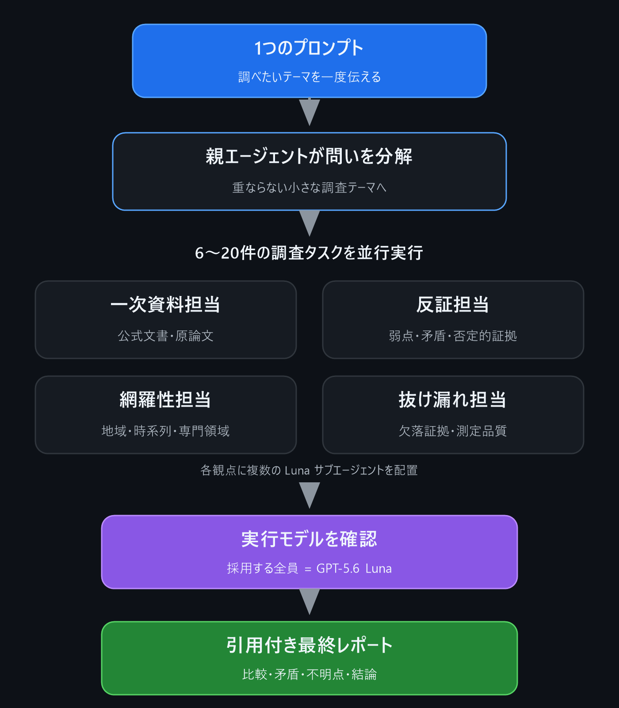

# Luna Research & Project Skills

[](https://github.com/dj-thank/luna-research-skills/actions/workflows/ci.yml)
[](https://github.com/dj-thank/luna-research-skills/releases/latest)

Codex の通常サブエージェントを **GPT-5.6 Luna** に固定し、広いプロジェクトの分解・実行・統合または広範調査を行い、採用する各子タスクの実行メタデータまで検証する、コミュニティ製の skills-only plugin です。

This community skills-only plugin safely pins fresh ordinary Codex subagents to **GPT-5.6 Luna**, then runtime-verifies each accepted project workstream or research scout.

## 3分 Quick Start

必要条件は Python 3.11 以上と、plugin marketplace に対応した現在の Codex です。

1. marketplace を登録します。公開リポジトリなので GitHub ログインは不要です。

   ```bash
   codex plugin marketplace add dj-thank/luna-research-skills
   ```

2. Codex デスクトップで **Plugins → `luna-research-skills` → Luna Research Skills → Install** の順に選び、新しいタスクを開きます。CLI ラッパーがない場合は Plugins 画面から marketplace も追加できます。
3. 次の1プロンプトで、read-only plan の確認から競合のない設定の適用まで依頼します。

   ```text
   $configure-luna-subagents を使って変更計画を表示し、競合がなければ適用して
   ```

4. Codex を再起動するか新しいタスクを開き、プロジェクトまたは調査を始めます。

   ```text
   $run-diverse-luna-project このプロジェクトを、設計・実装・テスト・文書・リリースの観点で進めて
   $run-diverse-luna-research このテーマを、一次資料・反証・地域差・時系列の観点で調査して
   ```

設定成功時は実際に次の状態が表示されます。

```text
INSTALLED: model=gpt-5.6-luna, max_threads=40, max_depth=2
STATE: managed installation is intact
READY: static Luna subagent configuration is present.
```

`READY` は静的設定の確認です。実際に採用した子タスクは、各 orchestration Skill が `thread_source = "subagent"`、`model = "gpt-5.6-luna"`、`effort = "medium"` を runtime metadata で確認します。

## 1つのプロンプトから、プロジェクト全体をLunaで進める

`$run-diverse-luna-project` は、機能開発、移行、監査、リリース、複数成果物の制作を、成果・所有範囲・観点・工程・リスク・検証境界へ分解します。重複編集を避けるためファイル所有権と依存関係を固定し、Luna を小さな wave で動かし、親エージェントが統合と最終検証を担当します。

```text
$run-diverse-luna-project このWebサービスにアカウントデータのエクスポートと削除を追加し、
API・DB・画面・運用手順・段階リリースまで実装して検証して
```

各 workstream は採用前に Luna の runtime metadata を確認します。ローカルテスト、デプロイ済み状態、外部ネットワーク、物理端末、人間の体験は別々の検証境界として報告されます。

## 1つのプロンプトから、6〜20件の調査タスクを動かす

セットアップは最初の1回だけです。以後は調べたいテーマを**1つのプロンプトで頼むだけ**。親エージェントが問いを重ならない小さなテーマへ分解し、標準的な深掘りなら **6〜10件**、徹底調査なら **12〜20件**の調査タスクを Luna のサブエージェントへ割り当てます。

短い依頼でも始められます。

```text
$run-diverse-luna-research AIコーディングエージェント市場を一次資料中心に徹底調査して
```

観点や欲しい成果物も、同じ1つのプロンプトで細かく指定できます。

```text
$run-diverse-luna-research 2025〜2026年のAIコーディングエージェント市場を、
公式仕様・価格・ベンチマーク・セキュリティ・導入事例・反証の観点から
一次資料中心に調べ、意思決定向けの比較表と引用付き結論にまとめて
```

> **入力は1回。** 内部では一次資料、反証、地域・時系列、欠落証拠を別々のサブエージェントが並行して分担し、最後に親エージェントが原典を再確認して1本のレポートへ統合します。

<!-- A static PNG is intentional: GitHub Mobile can expose Mermaid source instead of rendering it. -->
[](docs/assets/one-prompt-research-flow.png)

特に、技術動向や文献の横断調査、競合・市場比較、製品選定、政策比較、デューデリジェンスのように、**一人で検索すると視点が偏りやすい調査**に向いています。全タスクのうち、一次資料確認と反証確認にそれぞれ20%以上を割り当てます。

> [!IMPORTANT]
> このリポジトリは OpenAI 公式製品ではありません。2026-07-17 時点の Codex の挙動を利用しており、モデル名やサブエージェントのルーティング仕様は将来変わる可能性があります。

## 日本語

### 何を解決するか

公開 Skill の manifest には、`spawn_agent` ごとのモデルを直接指定する項目がありません。この plugin は次の三段階で、その制約を回避せずに検証可能な形へ落とします。

1. `~/.codex/agents/default.toml` に Luna 固定の default role を安全に導入する。
2. 通常の `spawn_agent` を必ず `fork_turns="none"` で起動し、その role を選ばせる。
3. 各 child rollout の `turn_context.model` が `gpt-5.6-luna` であることを確認してから、workstream や調査結果を採用する。

名前や nickname をモデルの証拠にはしません。実行メタデータが証拠です。

### インストール

必要条件は Python 3.11 以上と、plugin marketplace に対応した現在の Codex です。公開リポジトリの読み取りに GitHub ログインは不要です。

```bash
codex plugin marketplace add dj-thank/luna-research-skills
```

その後、Codex デスクトップの Plugins を開き、`luna-research-skills` marketplace から `Luna Research Skills` を選択してインストールし、新しい Codex タスクを開始してください。CLI ラッパーが利用できない場合は、Plugins 画面から marketplace の追加も行えます。

### 使い方

最初に、明示呼び出し専用の設定 Skill を使います。

```text
$configure-luna-subagents
```

Skill はまず read-only の plan を表示します。実適用では次の設定を行います。

- `features.multi_agent = true`
- `agents.max_threads = 40`
- `agents.max_depth = 2`
- `agents/default.toml` の `model = "gpt-5.6-luna"`

`max_threads = 40` はアカウント全体の容量上限で、同時に40件を起動する指定ではありません。プロジェクトSkillの試行予算は通常、focused projectで2〜4、broad projectで4〜8、互いに独立した大規模作業でも8〜12です。実行は小さなwaveに分けます。

既存値が衝突する場合は停止し、承認された replacement flag がある時だけ変更します。変更前ファイルは `CODEX_HOME/backups/luna-research-skills/` に保存され、書き込みは原子的です。

Codex を再起動するか新しいタスクを開いた後、広いプロジェクトにはプロジェクト Skill を使います。

```text
$run-diverse-luna-project CLI設定形式の移行を、互換性・変換器・テスト・文書・リリースの観点で進めて
```

一次資料中心の調査には調査 Skill を使います。

```text
$run-diverse-luna-research 量子誤り訂正の最新アプローチを一次資料中心に比較して
```

両 Skill は最初の有用な read-only workstream または scout を runtime probe として使い、Luna が確認できた場合だけ次の wave を開始します。以後も採用する全結果を検証します。

### 重要な影響範囲

`agents/default.toml` は研究専用ではなく、`fork_turns="none"` で default role を選ぶ全ての通常サブエージェントに作用します。親の履歴を丸ごと継承する fork、CSV 一括 fan-out、内部エージェント、別の custom role はこの保証範囲に含まれません。

復元する場合は、明示的に次を依頼します。

```text
$configure-luna-subagents を使って設定を復元して
```

管理後に対象ファイルが編集されていた場合、復元は停止してその編集を保護します。

### 検証

```bash
python -m unittest discover -s tests -v
python -m compileall -q plugins
```

テストは Linux / Windows、Python 3.11 / 3.13 の GitHub Actions でも実行します。互換性の根拠と既知の境界は [docs/verification.md](docs/verification.md) にまとめています。

## English

### 3-minute quick start

1. Run `codex plugin marketplace add dj-thank/luna-research-skills`.
2. In Codex desktop, choose **Plugins → `luna-research-skills` → Luna Research Skills → Install**, then open a new task.
3. Ask `$configure-luna-subagents` to show its read-only plan and apply it if there are no conflicts.
4. Restart Codex or open another task, then invoke `$run-diverse-luna-project` or `$run-diverse-luna-research`.

Successful setup reports `INSTALLED: model=gpt-5.6-luna` followed by `STATE: managed installation is intact`. Static readiness is not runtime proof; every accepted child is separately verified from rollout metadata.

### One prompt orchestrates a broad project

`$run-diverse-luna-project` decomposes feature work, migrations, audits, releases, and multi-artifact delivery by outcomes, ownership, perspectives, lifecycle stages, risks, and verification boundaries. It runs disjoint Luna workstreams in bounded waves while the root owns shared interfaces, integration, external-action gates, and final acceptance.

```text
$run-diverse-luna-project Add account data export and deletion to this service,
covering the API, database, UI, operations, and staged release validation.
```

Every accepted workstream passes the Luna runtime gate. Local tests, deployment state, external-network reachability, physical devices, and human experience remain separately reported boundaries.

### One prompt launches 6-20 verified research tasks

After the one-time setup, give Codex one research prompt. The root coordinator splits it into distinct questions and delegates **6-10 focused research tasks** for a standard deep dive or **12-20** for an exhaustive investigation. Separate Luna subagents cover primary sources, adversarial evidence, domain or regional perspectives, and missing evidence; the root then reopens conclusion-grade sources and produces one cited report.

Start with a short request:

```text
$run-diverse-luna-research Thoroughly research the AI coding-agent market using primary sources.
```

Or specify the perspectives and output you want in the same prompt:

```text
$run-diverse-luna-research Compare the 2025-2026 AI coding-agent market using
official specifications, pricing, benchmarks, security evidence, adoption cases,
and adversarial findings, then produce a decision-ready table and cited conclusion.
```

Every accepted scout passes the Luna runtime gate shown above. At least 20% of the assignment budget targets primary-source verification and at least 20% targets adversarial or disconfirming evidence.

### Install

Require Python 3.11+ and a current Codex build with plugin marketplaces:

```bash
codex plugin marketplace add dj-thank/luna-research-skills
```

Then open Plugins in Codex desktop, install `Luna Research Skills` from the `luna-research-skills` marketplace, and start a new Codex task. If the CLI wrapper is unavailable, add the marketplace from the Plugins view as well.

### Use

Invoke `$configure-luna-subagents` explicitly. It shows a read-only plan, discloses the global default-role blast radius, and applies only after explicit authorization. Existing conflicting values require separate replacement flags and are backed up before atomic writes.

After restarting Codex or opening a new task, invoke `$run-diverse-luna-project` for broad delivery or `$run-diverse-luna-research` for source-heavy investigation. Both skills use only ordinary `spawn_agent` calls with `fork_turns="none"`, verify the first useful read-only result before fan-out, and validate every accepted child's rollout metadata.

### Guarantee boundary

The plugin controls a user-level default agent role because the current public Skill/plugin manifest does not expose a per-spawn model selector. The guarantee covers fresh ordinary default-role subagents spawned with `fork_turns="none"`. It does not cover full-history forks, bulk CSV fan-out, internal agents, or other custom roles.

## License

[MIT](LICENSE). Security reports should follow [SECURITY.md](SECURITY.md).
