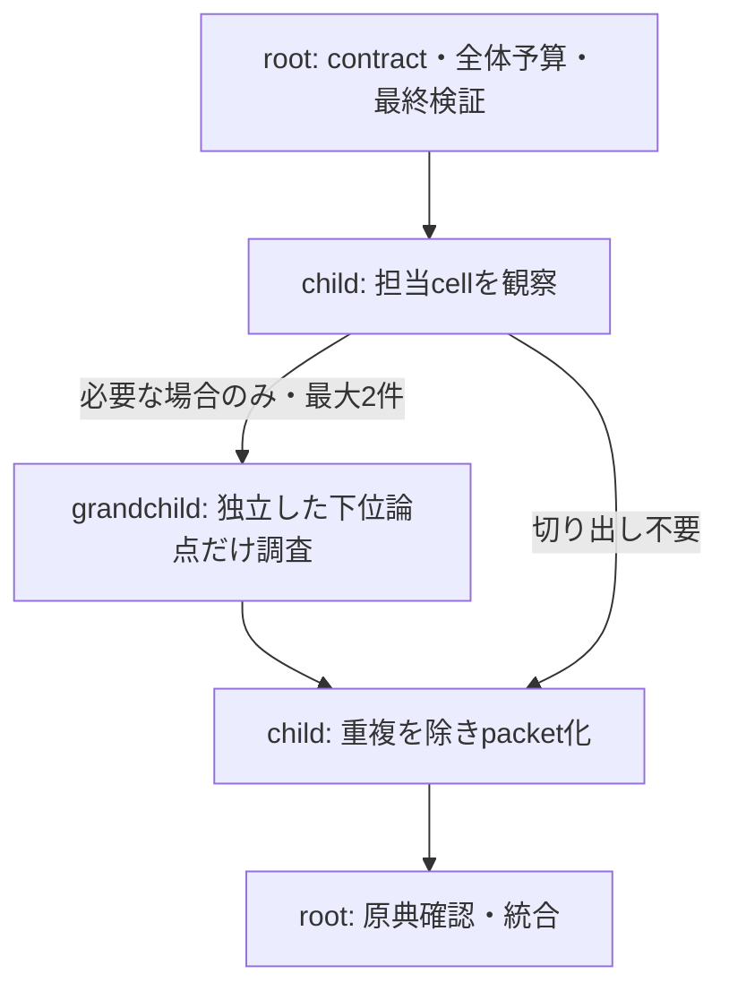

# Luna Research Prompt for Codex

Codex のネイティブなサブエージェントを **GPT-5.6 Luna** で動かし、観察した論点を必要な時だけもう一段深く切り出して、一次資料・反証・抜け漏れ確認を分担するための、自己完結したコミュニティ製プロンプトです。

インストーラー、Python、plugin、marketplace、MCP は使いません。必要なのは `config.toml` の設定と [`PROMPT.md`](PROMPT.md) だけです。

> [!IMPORTANT]
> このリポジトリは OpenAI 公式製品ではありません。Codex の設定名、モデルの提供状況、サブエージェント機能は将来変わる可能性があります。

## 使い方

### 1. `config.toml` を編集する

Codex のユーザー設定ファイルを開きます。

- Windows: `%USERPROFILE%\.codex\config.toml`
- macOS / Linux: `~/.codex/config.toml`

既存の `[agents]` セクションへ次の項目を追加または統合してください。

```toml
[agents]
enabled = true
max_concurrent_threads_per_session = 40
max_threads = 40
max_depth = 2
default_subagent_model = "gpt-5.6-luna"
default_subagent_reasoning_effort = "medium"
```

`[agents]` がすでにある場合、同じ見出しをもう1つ作らず、その中の値を更新します。`40` は同時に40件起動する指定ではなく、1セッションで開いておける子タスクの上限です。`max_threads` は現行名 `max_concurrent_threads_per_session` の旧 alias で、古い実行面との互換用に同じ値を置きます。

`max_depth = 2` は root → child → grandchild の二段階委任を意図した互換設定です。現在の公開 Configuration Reference には掲載されていないため、この行だけで階層実行を保証しません。プロンプト側でも深度と総起動数を制限し、実際の task metadata で確認します。

> [!WARNING]
> この既定値は研究専用ではありません。モデルを個別指定していない通常のサブエージェントは、ほかのタスクでも Luna になります。Luna を利用できないアカウントや実行環境では、この設定だけで利用可能になるわけではありません。

### 2. Codex を再起動する

設定を読み直すため、Codex を再起動するか新しいタスクを開始します。

### 3. プロンプトを貼る

[`PROMPT.md`](PROMPT.md) のコードブロック全体をコピーし、末尾の `RESEARCH REQUEST` を自分の質問に書き換えて Codex に貼り付けます。

これだけです。プロンプトは Codex のネイティブな subagent runner を使い、利用可能な実行面では Luna scout を小さな wave で動かします。各 child はまず自分の担当範囲を観察し、独立した下位論点が本当に必要な場合だけ、割り当てられた予算内で grandchild へ切り出します。

プロンプトは設定ファイルを編集せず、Skill、plugin、checker、helper script も生成・インストールしません。

## `config.toml` とプロンプトの役割

`config.toml` は、明示的なモデル指定を持たない子エージェントの既定モデルと推論強度を設定します。調査の分解、証拠形式、反証枠、統合手順は `PROMPT.md` が担当します。

つまり、設定だけでは調査 workflow は生えません。一方、プロンプトだけを別環境へ持っていった場合も best-effort で動きますが、その環境にサブエージェント機能や Luna がなければ、Luna 実行を名乗らず root-only fallback として報告します。

## Bounded hierarchy


```mermaid
flowchart TD
    R["root: contract・全体予算・最終検証"]
    C["child: 担当cellを観察"]
    G["grandchild: 独立した下位論点だけ調査"]
    S["child: 重複を除きpacket化"]
    O["root: 原典確認・統合"]
    R --> C
    C -->|"必要な場合のみ・最大2件"| G
    G --> S
    C -->|"切り出し不要"| S
    S --> O
```

- 最大深度は root=0、child=1、grandchild=2。grandchild は子孫を起動しません。
- child ごとの descendant allowance は通常0〜2件です。
- root が固定した global assignment budget `N` を全階層で共有し、失敗や拒否も消費として数えます。
- child が観察して「独立した問い・別の情報源・明確な期待価値」がある時だけ深く切り出します。
- 階層起動を確認できなければ flat/root-only fallback として報告し、recursive Luna と呼びません。

## Runtime verification status

2026-08-03 の Codex desktop probe では、ネイティブrunnerの階層機構は root → child → grandchild まで到達しました。観測できたtask identityは次の通りです。

```text
/root/hierarchy_mechanics_probe
/root/hierarchy_mechanics_probe/grandchild_hierarchy_probe
```

このmechanics probeは、利用可能だった別モデルを明示した非Lunaテストです。公式Subagents資料は `gpt-5.6-luna` を狭く反復的なagent向けモデルとして掲載し、global default設定も公開しています。しかし `gpt-5.6-luna` の既定ルートとLuna専用roleは、今回の実行面ではどちらも `Unknown model` と拒否されました。フルアクセスでの再試行も同じ結果だったため、権限やsandboxではなくmodel routingのBLOCKEDとして扱います。したがって、現時点で証明できたのは「ネイティブなdepth=2委任」であり、「Lunaによるdepth=2実行」ではありません。

プロンプトはLuna起動が拒否された場合、別モデルへ黙って切り替えません。root-onlyへ戻し、`Luna fan-out未実施` と理由を報告します。モデル提供状況が変わったら、同じprobeを再実行してこの境界を更新します。

## 保証の境界

- 個別 spawn の明示モデルや custom agent の設定は、`[agents]` の既定値より優先されます。
- task name や nickname は、実際のモデルを証明しません。
- 実行メタデータを確認できない環境では、プロンプトは「Luna 未検証」と明記します。
- `max_depth` は現在の公開設定リファレンスにない互換設定です。受理されたことと、実際にgrandchildが動いたことを別々に扱います。
- 別モデルで成功した階層probeをLunaの証拠にしません。Luna routeの `Unknown model` はBLOCKEDとして扱います。
- Web、MCP、外部サービス、ファイル変更、公開、購入などの権限は、この設定やプロンプトによって拡張されません。
- ChatGPT の通常チャットなど、Codex の `config.toml` と subagent runner を持たない環境では同じルーティング保証はありません。

設定項目の現在の定義は Codex の [Configuration Reference](https://learn.chatgpt.com/docs/config-file/config-reference) と [Subagents](https://learn.chatgpt.com/docs/agent-configuration/subagents) を確認してください。

## 旧 plugin 版

Python installer と3つの Skill を含む旧版は、Git 履歴と [`v0.3.0`](https://github.com/dj-thank/luna-research-skills/releases/tag/v0.3.0) に保存されています。main ブランチの v1.0 以降は prompt-first です。

## License

[MIT](LICENSE)
