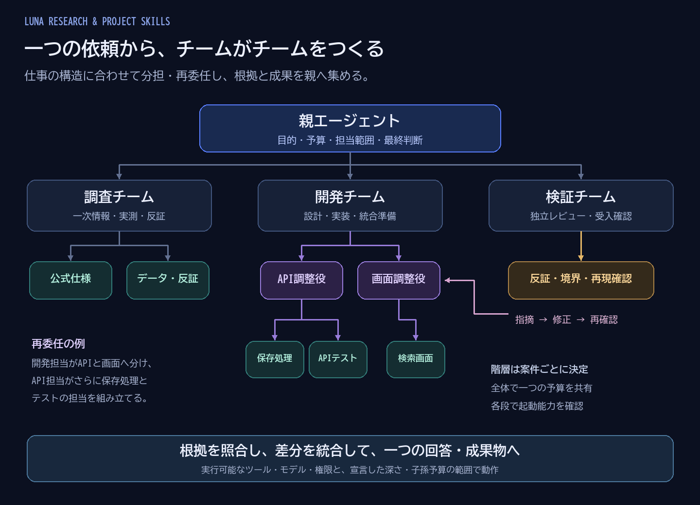

# Luna Research & Project Skills

[](https://github.com/dj-thank/luna-research-skills/actions/workflows/validate.yml)
[](https://github.com/dj-thank/luna-research-skills/releases)

## 一つの依頼から、調査・実装・検証のチームを組み立てる

「このテーマを徹底的に調べたい」「このプロジェクトを実装から検証まで進めたい」。その依頼を、独立して進められる仕事に分け、Codexのネイティブなサブエージェントへ渡すスキル集です。

**担当が必要に応じてさらにチームをつくり、関連する担当は相談し、検証担当が問題を見つけ、元の担当が修正を続ける。** 最後に親が出典と成果を確認し、一つの回答や変更へ統合します。

実務を担うのは **GPT-5.6 Luna / max**。親にはGPT-6 Astraなど、ユーザーが選んだモデルを使えます。再委任を担う調整役のモデルも明示的に選べる構成にしています。モデル名を頼りに成功を決めず、実際に動いたモデル・親子関係・完了記録まで検証します。

[](docs/assets/recursive-teams.png)

この図は構成の一例です。階層も人数も固定ではなく、仕事の依存関係と、各段で実際に使えるツールに合わせて決めます。

## 二つのスキル

| | Luna Research | Luna Project |
|---|---|---|
| 得意な仕事 | 技術・文献・市場・制度などの横断調査、比較、事実確認 | 機能開発、監査と修正、移行、複数成果物の制作、リリース準備 |
| 主な分担 | 一次資料、実測、反証、地域差、時系列、証拠の欠落 | API、DB、画面、テスト、運用、互換性、独立レビュー |
| 親がまとめるもの | 出典付きの結論、比較表、矛盾と不明点 | 担当ごとの変更、統合結果、検証結果と残る課題 |
| 呼び出し | `$run-diverse-luna-research` | `$run-diverse-luna-project` |

Researchの担当は証拠を返します。Projectの実装担当は、割り当てられたファイルやworktreeで変更を作ります。調査と実装を組み合わせる場合も、担当範囲と最終統合の責任を明確にします。

Projectは**Lunaによる実装を明示した場合**に選びます。一つの資料で済む確認や、一ファイルの小修正は、親が直接進める方が適しています。

## 1つのプロンプトから、広い調査を一本の結論へ

短い依頼から始められます。

```text
$run-diverse-luna-research
AIコーディングエージェントの現状を、一次資料中心に徹底調査して。
```

判断したいことを添えると、調査の分担を具体的にできます。

```text
$run-diverse-luna-research
小規模な開発チームで採用するAIコーディング環境を比較してください。
公式仕様・料金・実測・セキュリティ・導入事例・反証を分担し、
私たちの選択に影響する違いを比較表と出典付きの結論にまとめてください。
```

内部では、例えば次のように分かれます。

| 担当 | 確かめること |
|---|---|
| 公式資料 | 提供元が実際に保証している機能と条件 |
| 実測・評価 | 数値の測定条件、再現性、比較できる範囲 |
| 反証 | 結論を変え得る弱点、失敗例、例外 |
| 地域・時系列 | 国や版、時期の違いで話が変わらないか |
| 欠落の確認 | 調べられていない重要な論点と、その影響 |

親はそれぞれの結果を並べるだけでなく、結論を支える原典を確認します。同じ発表の転載を複数の裏付けに数えず、条件が違う数値をそのまま比較せず、食い違いが残れば不明点として示します。

標準的な深掘りでは総試行予算8〜16、大きな調査では16〜32が目安です。これは固定の起動数ではありません。必要な根拠がそろえば、余った予算を残して回答します。

## 1つのプロンプトから、プロジェクトを分解・実装・統合する

```text
$run-diverse-luna-project
Lunaで、このWebサービスにデータのエクスポート機能を追加してください。
API・保存処理・画面・テスト・運用手順を分担し、
既存の変更を保全したうえで、実装と独立検証まで進めてください。
```

大きい部分は、担当する調整役がさらに分解できます。たとえば開発チームをAPIと画面のチームへ分け、APIチームが保存処理・形式変換・互換性テストの担当を置く構成です。

実装担当はそれぞれの所有範囲で作業し、依存する変更がそろってから統合します。検証担当は最初に独立して確認し、問題を見つけた後で実装担当と再現条件や修正結果をやり取りします。

**分担 → 並行実行 → 指摘 → 修正継続 → 再検証 → 親で統合**までを、一つの作業として扱います。

## エージェントが、さらにエージェントを呼ぶ

今回の再帰対応では、固定の「親→調整役→末端」で止める制限を外しました。

```text
親
├─ 調査の調整役
│  ├─ 公式仕様の担当
│  └─ 評価の調整役
│     ├─ 実測データの担当
│     └─ 反証の担当
└─ 開発の調整役
   ├─ APIの調整役
   │  ├─ 保存処理の担当
   │  └─ テストの担当
   └─ 画面の担当
```

`max_workflow_depth`は案件ごとに宣言します。調整役は、その深さと割り当てられた子孫予算の範囲で、下位の調整役や専門担当を編成できます。親が最初からすべての末端プロンプトを書く必要はありません。

予算は全体で一つです。子を1体起動し、その子へさらに3体分を渡すなら、親の割当から4枠を確保します。下位のチームができるたびに、新しい全体予算が生まれる仕組みではありません。チェッカーは、深さの飛び越し・子孫予算の超過・偽の親子関係・台帳上の回収前の完了を拒否します。実際に結果を受け取ったことは、親がメッセージと成果物を確認します。

### モデル構成と実際の対応範囲

| 構成 | 調整役 | 実務担当 | 選び方 |
|---|---|---|---|
| Lunaで統一 | Luna / max | Luna / max | 従来の既定。各調整役に再委任ツールが公開されている環境で階層化 |
| Astraで調整、Lunaで実務 | Astra・明示した推論強度 | Luna / max | ユーザーが明示した場合に使う追加構成。台帳と検証コマンドの両方で指定 |

**2026年9月5日の実測では、Astraを継承したネイティブ分業は深さ3まで起動・回収できました。一方、この環境のLunaの子には再委任ツールが公開されていませんでした。** スキルの深度制限と、実行環境の能力は別に扱います。Lunaの名前で起動しただけで、再帰分業まで成功したとは扱いません。

調整役の構成を明示する場合の依頼例です。

```text
$run-diverse-luna-project
調整役にはGPT-6 Astra、調査・実装・検証の専門担当にはLuna/maxを使ってください。
必要な部分は下位の調整役へ再委任し、全体で一つの予算を共有してください。
親のモデル設定は変更せず、実際の親子関係とモデルを確認して進めてください。
```

詳しい条件は[再帰委任の契約](.agents/skills/run-diverse-luna-project/references/recursive-delegation.md)と[モデル構成の指定](.agents/skills/run-diverse-luna-project/references/model-policy.md)にまとめています。

## 相談・継続・監査も、分業の一部

- **関連担当同士の相談**：親が指定した相手と、根拠・変更点・確認してほしいことを共有します。見解が割れたら、両方の証拠を親へ戻します。
- **同じ担当で修正を続ける**：`followup_task`で必要な差分を渡し、これまでの文脈を活かします。継続分も予算に数えます。
- **独立した検証**：実装者の結論を先に渡さず、成果物と受入条件から確認します。修正が入れば古い合格をそのまま使いません。
- **途中で目的が変わる**：影響する枝を止めて組み直し、有用な出典や成果は残します。
- **担当が使えない・応答しない**：期限内に親へ戻し、未着手部分を同じ予算内で再配置します。再委任できない環境では、親からの直接分担へ戻ります。

## はじめる

Python 3.11以上と、スキル・サブエージェント・使いたいモデルを利用できるCodex環境が必要です。Web調査には検索・閲覧ツールも必要です。

### このリポジトリで試す

```sh
git clone https://github.com/dj-thank/luna-research-skills.git
cd luna-research-skills
```

このフォルダーをCodexのプロジェクトとして開き、新しいタスクで上の依頼例を使ってください。`.agents/skills`にResearchとProjectがあり、`.codex/agents`には任意のカスタム役割を収録しています。役割の利用可否は現在の実行環境で確認します。[公式のスキル読み込み仕様](https://learn.chatgpt.com/docs/build-skills#where-codex-loads-local-skills)

最新の変更はmainに入ります。[Releases](https://github.com/dj-thank/luna-research-skills/releases)は公開時点の固定版です。2026年9月5日時点の最新Release `v2.0.6`には、mainの9月の改善はまだ含まれていません。

### ほかのプロジェクトでも使う（Windows）

PowerShell 7でリポジトリのルートから、現在の配置と追加内容を確認します。

```powershell
pwsh -NoProfile -File tools/Test-LunaSkillDiscovery.ps1 -SkillRoot .agents/skills
pwsh -NoProfile -File tools/Install-LunaSkillsUserScope.ps1 -Source .agents/skills
```

内容を確認したら、`-Apply`で導入します。

```powershell
pwsh -NoProfile -File tools/Install-LunaSkillsUserScope.ps1 -Source .agents/skills -Apply
```

配置先は `$HOME/.agents/skills` です。このインストーラーは新規導入用で、既存の同名スキルを上書きしません。更新・旧配置からの移行は[移行手順](tools/MIGRATION.md)に従って、差分とバックアップを確認してください。親モデルやエージェントのグローバル設定は変更しません。

導入後は新しいタスクで確認し、変更が表示されなければCodexを再起動してください。

### Codex cloud・pluginで使う

CloudではこのGitHubリポジトリと使いたいbranchを環境へ接続し、リポジトリ内のスキルを使います。Web調査には環境側のインターネット設定が必要です。

カスタム役割が公開されない環境では、モデル・推論強度・独立文脈を明示できる `worker` 経路を検証して利用します。どの構成でも、公開されていないツールやモデルをあるものとして進めません。

Releaseのplugin ZIPはスキルを収録し、カスタムエージェント定義は含みません。配布ファイルは同じ版の `SHA256SUMS` と照合してから導入してください。

## 全体をどう管理するか

| 項目 | 意味 |
|---|---|
| `N` | 全階層の起動・継続・再試行を含む総予算 |
| `C` | 同時に動ける数。環境の上限以下 |
| `W` | 一つのwaveで開始する数 |
| `V` | 独立検証・反証のために残す枠 |
| `max_workflow_depth` | この案件で使う深さの上限 |
| `descendant_budget` | 一人の調整役へ渡す、全子孫分の予算 |

同時実行上限40の環境でも、常に40体を起動するわけではありません。独立した仕事・期限・実行能力に合わせて展開します。仕事が大きくなれば下位のチームを置き、同じファイルを触る変更や共有リソースは一つの担当にまとめます。

出典の数、エージェントの数、合格という文章だけでは受入を決めません。実行モデル・完了ターン・親からの起動経路・出典や成果物・必要なテストを確認して採用します。

## 検証と権限

公開Webの調査でも、役割名や静的設定だけで実行時の読み取り専用は証明できません。私的な情報や認証済みサービスは親が扱い、公開・送信・購入・削除・デプロイは、依頼された権限の範囲で行います。スキルの導入や分業そのものが、追加の操作権限になることはありません。[詳細](SECURITY.md)

CIではPython 3.11〜3.13 × Windows/macOS/Linux、PowerShellの移行テスト、CodeQL、反復検証を実行します。深さ3・4や子孫予算の拒否条件は合成ケース、ネイティブな親子起動は実行記録で別々に確認します。速度・トークン削減率や、すべての環境での再委任を保証するものではありません。

| 資料 | 内容 |
|---|---|
| [Research](.agents/skills/run-diverse-luna-research/SKILL.md) / [Project](.agents/skills/run-diverse-luna-project/SKILL.md) | スキル本体 |
| [開発・検証手順](CONTRIBUTING.md) | 変更時の確認と配布物の生成 |
| [評価記録](docs/research-evaluation-2026-09-05.md) | 実行したこと、合成検証、未測定の範囲 |
| [変更履歴](CHANGELOG.md) | バージョンごとの差分 |
| [公式サブエージェント仕様](https://learn.chatgpt.com/docs/agent-configuration/subagents) | Codex側の機能と設定 |

コミュニティ製のスキル集です。ライセンスは[MIT](LICENSE)です。
