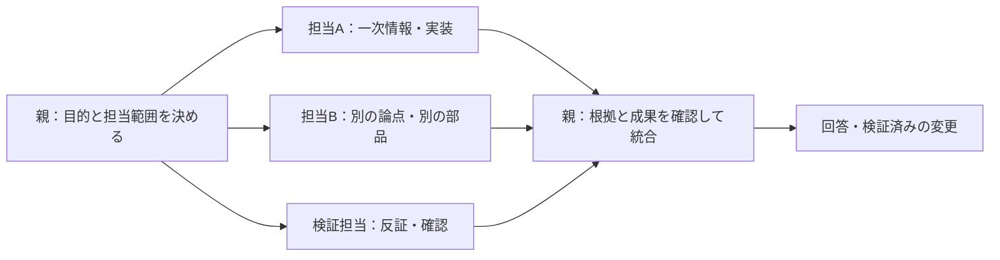

# Luna Research & Project Skills

**Codexの調査と開発を、GPT-5.6 Lunaの小さな担当へ分担するスキル集です。**

親エージェントが目的と最終判断を持ち、子エージェントが独立した調査・実装・検証を担当します。GPT-6 Astraなど、親に選んだモデルはそのまま。このスキルで使う子は **`gpt-5.6-luna` / `max`** を実行記録で確認します。

人数を増やすことより、根拠のある答えと、検証できる成果物を重視します。

## どちらを使う？

| やりたいこと | スキル | 受け取るもの |
|---|---|---|
| 複数の選択肢を調べて比較したい。仕様や主張を確かめたい | [Luna Research](.agents/skills/run-diverse-luna-research/SKILL.md) | 出典付きの判断材料、反証、不明点を整理した回答 |
| Lunaに分担させて実装・修正・移行を進めたい | [Luna Project](.agents/skills/run-diverse-luna-project/SKILL.md) | 担当ごとの成果を統合し、必要な検証を済ませた変更 |

一つの公式ページで済む質問や、一ファイルの小修正は親が直接進めます。Projectは、**Lunaによる実装を明示し、独立した担当範囲へ分けられる場合**に使います。通常の実装依頼を自動的にLuna Projectへ切り替えるものではありません。

## 依頼の例

導入後、Codexにそのまま渡せます。

### 調べて、判断する

```text
$run-diverse-luna-research
このサービスで採用する検索エンジンを比較してください。
公式仕様、実測データ、運用上の弱点を調べ、候補を絞ってください。
出典と、まだ分からない点も示してください。
```

### 作って、確認する

```text
$run-diverse-luna-project
Lunaで検索APIと検索画面を分担して実装してください。
既存の変更を保全し、担当ごとに検証してから親が統合してください。
公開や本番デプロイは含めません。
```

途中で「投稿用に短くして」「この条件を優先して」と訂正しても、使える調査結果は残し、影響する担当の仕事を組み直します。

## はじめる

必要なのは、スキルとサブエージェントを利用できるCodex環境、Lunaへのアクセス、検証スクリプト用の **Python 3.11以上** です。Web調査には、その環境で利用できる検索・閲覧ツールも必要です。

### このリポジトリで試す

```sh
git clone https://github.com/dj-thank/luna-research-skills.git
cd luna-research-skills
```

このフォルダーをCodexのプロジェクトとして開き、新しいタスクで上の依頼例を使ってください。リポジトリ内の `.agents/skills` を利用するため、ユーザー共通フォルダーへのコピーは不要です。スキルの読み込み場所は[Codex公式ドキュメント](https://learn.chatgpt.com/docs/build-skills#where-codex-loads-local-skills)で確認できます。

**最新の改善を使う場合はmainを選んでください。** [Releases](https://github.com/dj-thank/luna-research-skills/releases)は公開時点の固定版です。2026年9月5日時点の最新Releaseは `v2.0.6` で、このREADMEが説明する9月の改善はmainに入っています。

### ほかのプロジェクトでも使う（Windows）

PowerShell 7で、リポジトリのルートから実行します。まず現在の配置と、追加される内容を確認します。

```powershell
pwsh -NoProfile -File tools/Test-LunaSkillDiscovery.ps1 -SkillRoot .agents/skills
pwsh -NoProfile -File tools/Install-LunaSkillsUserScope.ps1 -Source .agents/skills
```

内容を確認したら、`-Apply`を付けて導入します。

```powershell
pwsh -NoProfile -File tools/Install-LunaSkillsUserScope.ps1 -Source .agents/skills -Apply
```

配置先は `$HOME/.agents/skills` です。このインストーラーは**新規導入用**で、既存の同名スキルを上書きしません。更新や旧配置からの移行では、[移行手順](tools/MIGRATION.md)に沿って既存コピー・差分・バックアップを確認してください。別の内容を持つ同名スキルを複数の場所へ置くと、意図した版を選べなくなります。

導入後は新しいタスクでスキル名を確認します。変更が表示されない場合はCodexを再起動してください。エージェント設定や親モデルの設定は、このインストーラーでは変更しません。

### Codex cloudで使う

GitHubのこのリポジトリと使いたいbranchをCloud環境へ接続します。リポジトリ内のスキルを使うため、上のユーザー共通インストールは不要です。Web調査が必要なら、その環境でインターネットへのアクセスを設定してください。

ローカルで使えるカスタム役割がCloudでも使えるとは限りません。スキルは現在のツールを確認し、利用できる経路だけで分担します。Cloud環境の検査には [cloud_smoke.py](tools/cloud_smoke.py) を用意しています。`--network` を付ける検査は外部への固定テスト通信を行うため、通常の導入確認とは分けて実行します。

## どう進めるか


```mermaid
flowchart LR
    P["親：目的と担当範囲を決める"] --> A["担当A：一次情報・実装"]
    P --> B["担当B：別の論点・別の部品"]
    P --> C["検証担当：反証・確認"]
    A --> R["親：根拠と成果を確認して統合"]
    B --> R
    C --> R
    R --> O["回答・検証済みの変更"]
```

仕事が大きく、独立した担当範囲が十分にある場合は、調整役が子を束ねる構成も使います。小さな仕事では親が直接担当へ依頼します。

- **必要な論点に絞る。** 追加調査は、未解決の主張や判断を変え得るものに限ります。根拠がそろえば、残った予算を使い切るための調査はしません。
- **根拠を確かめる。** 親が結論を支える出典を確認します。同じ情報源の別ページは、独立した裏付けが増えたとは数えません。
- **取得失敗を共有する。** アクセス拒否を別担当が繰り返さないようにします。取得できなかったことは、内容が存在しない・誤っているという証拠にはしません。
- **続きと独立検証を使い分ける。** 関連する修正にはV2の継続を使い、独立した検証は新しい文脈で行います。継続も予算へ数え、後続ターンへ初回起動の証明を流用しません。

起動数・同時実行数・検証用の予約・期限は親が管理します。具体的な上限と台帳の形式は、[Researchの実行手順](.agents/skills/run-diverse-luna-research/references/workflow.md)と[Projectの実行手順](.agents/skills/run-diverse-luna-project/references/workflow.md)を参照してください。

## 環境差と権限

Lunaの利用可否、公開される役割、子からの再委任は、Codexの実行環境に依存します。カスタム役割がない場合は、モデル・推論強度・独立した文脈を明示できる `worker` 経路を確認します。実行記録を検証できなければ、制約を示して親の単独作業へ戻ります。別モデルへの無断の切り替えはしません。

`read-only`という役割名や設定だけでは、実行時の読み取り専用を保証できません。私的な情報や認証済みサービスの操作は親が扱い、公開・送信・購入・削除などは、その操作に必要な権限の範囲でのみ行います。スキルを導入するだけで、こうした操作が許可されることはありません。詳しくは[データと権限の扱い](SECURITY.md)を参照してください。

## 配布物

[Releases](https://github.com/dj-thank/luna-research-skills/releases)では、次のファイルを配布します。利用する版の `SHA256SUMS` と照合してから導入してください。

| ファイル | 内容 |
|---|---|
| `luna-skill-vX.Y.Z.zip` | スキル・任意のエージェント定義・ツールを含むソース一式 |
| `luna-hierarchical-skills-X.Y.Z-plugin.zip` | plugin形式のスキル集。カスタムエージェント定義は含まず、対応環境では `worker` 経路を使用 |
| `SHA256SUMS` | 配布ファイルのSHA-256 |
| `luna-skill-vX.Y.Z.spdx.json` | 収録ファイルの一覧とハッシュを持つSBOM |

公開済みReleaseは差し替えません。mainの更新は、既存Releaseを更新する操作とは別です。

## 検証・開発

Python 3.11〜3.13 × Windows/macOS/Linux、PowerShellの移行テスト、CodeQL、反復テストをCIで確認しています。配布物は同じソースから2回生成し、ハッシュ一致を検証します。

2026年9月5日の改善では、実際のLuna/maxによる公開資料の取得と、pluginから展開したチェッカーによる `worker` の最終台帳検証を確認しました。スキル全体の速度向上・トークン削減率は未測定です。[評価記録と未検証の範囲](docs/research-evaluation-2026-09-05.md)を公開しています。

- [開発・検証手順](CONTRIBUTING.md)
- [変更履歴](CHANGELOG.md)
- [Codex公式：サブエージェント](https://learn.chatgpt.com/docs/agent-configuration/subagents)

## ライセンス

[MIT](LICENSE)
