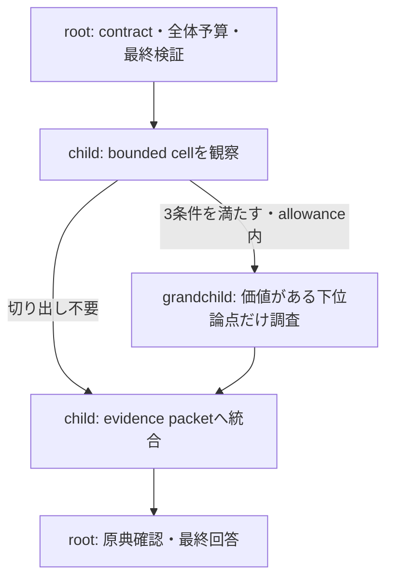

# Luna Research Prompt for Codex

Codex のネイティブ subagent を **GPT-5.6 Luna** へルーティングし、child が担当範囲を観察して、価値がある論点だけを grandchild へ切り出すための、自己完結したコミュニティ製プロンプトです。

公開物の本体は [`PROMPT.md`](PROMPT.md) です。Python、installer、plugin、marketplace、MCP、独自 runner は使いません。

> [!IMPORTANT]
> このリポジトリは OpenAI 公式製品ではありません。設定名、モデル提供状況、subagent機能は変更される可能性があります。

## Quick start

### 1. `config.toml` にルーティングを設定する

- Windows: `%USERPROFILE%\.codex\config.toml`
- macOS / Linux: `~/.codex/config.toml`

既存の `[agents]` セクションへ次を統合してください。同じ見出しを重複させないでください。

```toml
[agents]
enabled = true
max_concurrent_threads_per_session = 40
max_threads = 40
max_depth = 2
default_subagent_model = "gpt-5.6-luna"
default_subagent_reasoning_effort = "medium"
```

- `max_concurrent_threads_per_session` は現在の公開名です。`max_threads` は旧実行面との互換 alias です。
- `40` は常時40件を起動する指定ではなく、同時に開いておける子タスクの上限です。プロンプトは通常3〜6件の小さな wave に制限します。
- `max_depth = 2` は root → child → grandchild を意図した互換設定です。現在の公開 Configuration Reference には掲載されていないため、プロンプトでも深度と総起動数を制限し、runtime metadata で実行結果を確認します。
- この既定値はほかのタスクにも適用されます。個別 spawn や custom agent に明示されたモデル・推論強度がある場合は、そちらが優先されます。

### 2. 新しい Codex タスクを開始する

設定を保存したら、新しいタスクを開始してください。長く開いているタスクは、開始時の model allowlist を保持している場合があります。

### 3. プロンプトを貼る

[`PROMPT.md`](PROMPT.md) のコードブロック全体をコピーし、末尾の `RESEARCH REQUEST` だけを書き換えて貼り付けます。

これだけです。プロンプト自身は設定やファイルを変更せず、Codex のネイティブ機能だけで調査します。

## 核: bounded hierarchy


```mermaid
flowchart TD
    R["root: contract・全体予算・最終検証"]
    C["child: bounded cellを観察"]
    G["grandchild: 価値がある下位論点だけ調査"]
    P["child: evidence packetへ統合"]
    O["root: 原典確認・最終回答"]
    R --> C
    C -->|"3条件を満たす・allowance内"| G
    C -->|"切り出し不要"| P
    G --> P
    P --> O
```

この設計では、`max_threads` と `max_depth` を単なる上限ではなく、観察に基づく再帰的な分解へ使います。

- 最大深度: root=0、child=1、grandchild=2
- child ごとの descendant allowance: 0〜2
- 全階層で共有する assignment budget `N`
- 失敗、拒否、再試行も N を消費
- probeで child → grandchild のrouteを実証してからfan-out
- routeを確認できなければ flat / root-only へ縮退し、recursive Lunaとは呼ばない

## `config.toml` と `PROMPT.md` の役割

`config.toml` は、明示的なモデル指定を持たない subagent の既定モデルと推論強度を決めます。`PROMPT.md` は、問いの分解、再帰条件、予算、証拠形式、反証枠、root検証、完了条件を決めます。

したがって、Pythonなどの補助環境は不要ですが、Lunaへのルーティングと研究手順は別の役割です。プロンプトだけを別環境へ持っていくこともできます。その環境にLunaまたはnative subagentがなければ、Luna実行を名乗らずflat / root-only fallbackとして報告します。

## Runtime proof

2026-08-03 の fresh Codex task で、root → child → grandchild がすべて `gpt-5.6-luna`、reasoning effort `medium` で完了しました。

```text
root        019fc498-e57e-7d00-9122-676bc21e63ff  gpt-5.6-luna / medium
child       019fc499-9306-74d1-bcf1-f5bd7db5f2ab  gpt-5.6-luna / medium
grandchild  019fc499-d452-7b70-b707-6c14e2faced4  gpt-5.6-luna / medium
```

旧タスクで `Unknown model gpt-5.6-luna` が出ても、直ちにhost-wide障害とは限りません。同じhostのfresh taskで成功した実例では、原因は旧タスクに残ったstale model allowlistでした。

復旧順序は次のとおりです。

1. 設定を変更せず、新しい Codex タスクへ同じプロンプトを貼る。
2. fresh taskでも失敗する場合だけCodexを再起動する。
3. それでも失敗する場合は、その環境ではLuna routingを利用できないものとして報告する。

別モデルを明示してvalidatorを迂回する方法は、文書化された復旧策ではないため採用しません。

## Verification boundary

- task名やnicknameはモデルの証拠になりません。
- metadataを確認できない出力は `Luna unverified` とします。
- `max_depth` の受理と、grandchildの実行成功は別々に確認します。
- Web、MCP、外部サービス、ファイル変更、公開、購入などの権限は、この設定やプロンプトでは拡張されません。
- ChatGPTの通常チャットなど、Codexの `config.toml` とnative subagent runnerを持たない環境では同じroutingを保証しません。

現在の定義は Codex の [Configuration Reference](https://learn.chatgpt.com/docs/config-file/config-reference) と [Subagents](https://learn.chatgpt.com/docs/agent-configuration/subagents) を確認してください。

## Historical plugin version

Python installer と3つの Skill を含む旧版は、Git履歴と [`v0.3.0`](https://github.com/dj-thank/luna-research-skills/releases/tag/v0.3.0) に保存されています。mainのv1.0以降はprompt-firstです。

## License

[MIT](LICENSE)
