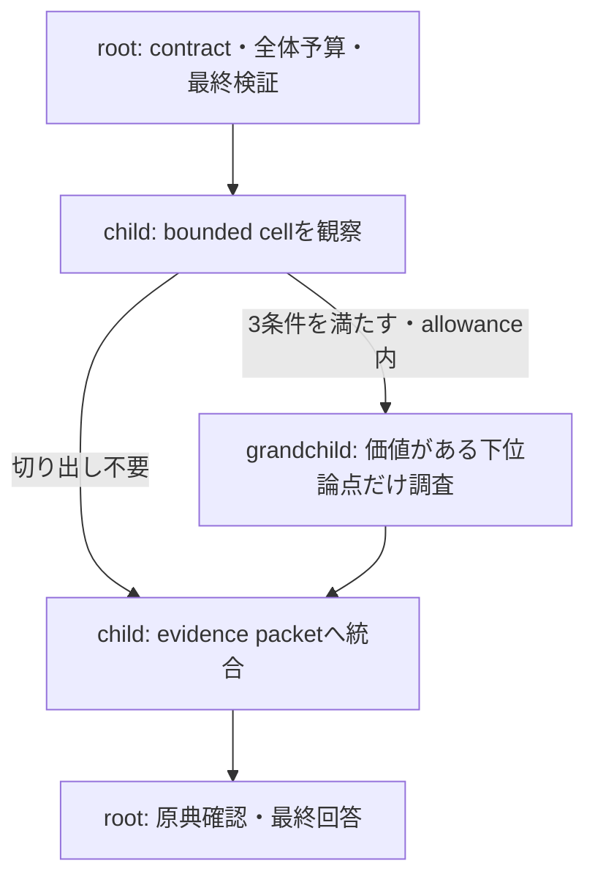

# Luna Research Prompt for Codex

Codex のネイティブ subagent を、利用可能な環境では **GPT-5.6 Luna** の既定モデルへルーティングし、child が担当範囲を観察して、価値がある論点だけを grandchild へ切り出すための、自己完結したコミュニティ製プロンプトです。Lunaの利用可能性や実行経路は、このリポジトリだけでは保証されません。

公開物の本体は [`PROMPT.md`](PROMPT.md) と [`PROMPT.en.md`](PROMPT.en.md) です。Python、installer、plugin、marketplace、MCP、独自 runner は使いません。

> [!IMPORTANT]
> このリポジトリは OpenAI 公式製品ではありません。設定名、モデル提供状況、subagent機能は変更される可能性があります。

## Quick start

### 1. `config.toml` にルーティングを設定する

- Windows: `%USERPROFILE%\.codex\config.toml`
- macOS / Linux: `~/.codex/config.toml`

既存の `[agents]` セクションへ次を統合してください。同じ見出しを重複させないでください。

```toml
[agents]
enabled = true
max_concurrent_threads_per_session = 6
default_subagent_model = "gpt-5.6-luna"
default_subagent_reasoning_effort = "medium"
```

- `max_concurrent_threads_per_session` は同時に開ける子タスク数の上限です。プロンプト側の assignment budget `N` と通常3〜6件の wave が、実際の起動数をさらに制限します。
- `max_threads` は旧名のaliasです。既存設定に残っている場合はどちらか一方だけを使い、canonical名と同時に設定しないでください。
- `max_depth` は現在の公開Configuration Referenceにないため、設定例には追加しないでください。root → child → grandchild の深度は、プロンプト内の台帳で論理的に管理します。これはruntime強制ではありません。
- この既定値はほかのタスクにも適用されます。個別 spawn や custom agent に明示されたモデル・推論強度がある場合は、そちらが優先されます。

### 2. 新しい Codex タスクを開始する

設定を保存したら、新しいタスクを開始してください。長く開いているタスクは、開始時の model allowlist を保持している場合があります。

### 3. プロンプトを貼る

日本語版の [`PROMPT.md`](PROMPT.md) または英語版の [`PROMPT.en.md`](PROMPT.en.md) のコードブロック全体をコピーし、末尾の `RESEARCH REQUEST` だけを書き換えて貼り付けます。

これだけです。プロンプト自身は設定やファイルを変更せず、Codex のネイティブ機能だけで調査します。

## 核: bounded hierarchy


```mermaid
flowchart TD
    R["root: contract・全体予算・最終検証"]
    C["child: bounded cellを観察"]
    G["grandchild: 価値がある下位論点だけ調査"]
    P["child: evidence packetへ統合"]
    O["root: 原典確認・最終回答"]
    R --> C
    C -->|"3条件を満たす・allowance内"| G
    C -->|"切り出し不要"| P
    G --> P
    P --> O
```

この設計では、Codexの同時実行上限とは別に、プロンプト内の台帳を使って観察に基づく再帰的な分解を制御します。

- 最大深度: root=0、child=1、grandchild=2
- child ごとの descendant allowance: 0〜2
- 全階層で共有する assignment budget `N`
- 失敗、拒否、再試行も N を消費
- probeで child → grandchild のrouteを実証してからfan-out
- routeを確認できなければ flat / root-only へ縮退し、recursive Lunaとは呼ばない

## `config.toml` と `PROMPT.md` の役割

`config.toml` は、明示的なモデル指定を持たない subagent の既定モデルと推論強度を決めます。`PROMPT.md` は、問いの分解、再帰条件、予算、証拠形式、反証枠、root検証、完了条件を決めます。assignment budget、depth、descendant allowanceはprompt-levelの台帳であり、spawn toolの戻り値やruntimeが自動で強制するものではありません。

したがって、Pythonなどの補助環境は不要ですが、Lunaへのルーティングと研究手順は別の役割です。プロンプトだけを別環境へ持っていくこともできます。その環境にLunaまたはnative subagentがなければ、Luna実行を名乗らずflat / root-only fallbackとして報告します。fresh-contextの引数はCodexの世代で異なるため、`fork_turns="none"` が公開されていない現行系では `agent_type="default"` と `fork_context=false` を使います。

## Historical runtime evidence

2026-08-03 の作者環境のfresh Codex taskでは、root → child → grandchild がすべて `gpt-5.6-luna`、reasoning effort `medium` で完了しました。この記録は現在の全アカウント、全リリース、全実行面に対する保証ではありません。公開読者が再実行し、各childのruntime metadataを確認してください。

```text
root        gpt-5.6-luna / medium
child       gpt-5.6-luna / medium
grandchild  gpt-5.6-luna / medium
```

`Unknown model gpt-5.6-luna` が出た場合は、その環境またはアカウントでの利用可能性を確認してください。まず設定を変更せずfresh taskで一度再試行し、それでも失敗する場合は現在のCodex、アカウント、モデル提供状況を確認します。

復旧順序は次のとおりです。

1. 設定を変更せず、新しい Codex タスクへ同じプロンプトを貼る。
2. fresh taskでも失敗する場合だけCodexを再起動する。
3. それでも失敗する場合は、その環境ではLuna routingを利用できないものとして報告する。

別モデルを明示してvalidatorを迂回する方法は、文書化された復旧策ではないため採用しません。

## Verification boundary

- task名やnicknameはモデルの証拠になりません。
- metadataを確認できない出力は `Luna unverified` とします。
- 論理的な最大深度を台帳に記録することと、grandchildの実行成功は別々に確認します。
- assignment budget、depth、descendant allowanceはprompt-levelの台帳であり、runtimeの強制やspawn結果の証明ではありません。
- Web、MCP、外部サービス、ファイル変更、公開、購入などの権限は、この設定やプロンプトでは拡張されません。
- ChatGPTの通常チャットなど、Codexの `config.toml` とnative subagent runnerを持たない環境では同じroutingを保証しません。
- 現行のspawn戻り値が `agent_id` と nickname だけでmetadataを含まない場合、そこからモデルを推測してはいけません。確認できない結果は `Luna unverified` と報告します。

現在の定義は Codex の [Configuration Reference](https://learn.chatgpt.com/docs/config-file/config-reference) と [Subagents](https://learn.chatgpt.com/docs/agent-configuration/subagents) を確認してください。

## Data handling

RESEARCH REQUEST、取得した資料、subagentの入力と結果は、親タスクで有効なsubagent、Web、MCP、その他の外部サービスへ渡る可能性があります。秘密、個人情報、社内限定情報、未公開コード、credentialを、明示的な承認と組織のデータ取扱い方針なしに入力しないでください。read-onlyはデータの外部送信や保持を意味しません。

仕様やモデル提供状況は変わるため、実演・登壇前にも上記公式ドキュメントと実行metadataを再確認してください。

## Historical plugin version

Python installer と3つの Skill を含む旧版は、Git履歴と [`v0.3.0`](https://github.com/dj-thank/luna-research-skills/releases/tag/v0.3.0) に保存されています。mainのv1.0以降はprompt-firstです。

## License

[MIT](LICENSE)

Security and responsible disclosure guidance: [SECURITY.md](SECURITY.md)
