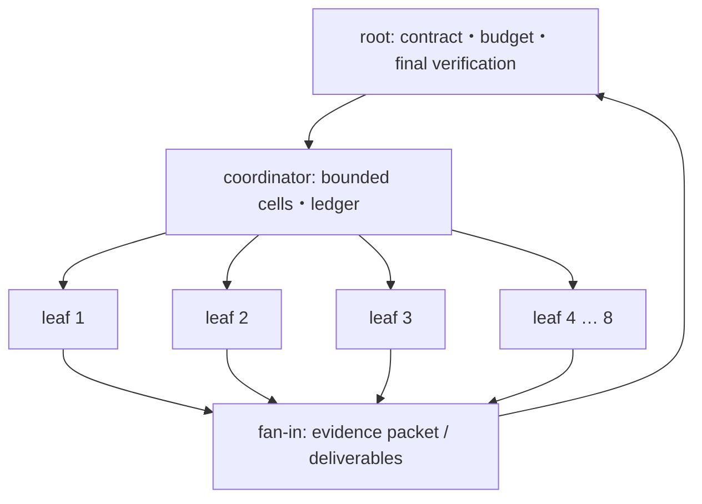

# Luna hierarchical skills

このリポジトリは、Codex のネイティブ subagent を使う調査・プロジェクト作業のための、repository-scoped Skill、custom-agent definition、安全な発見・移行ツール、運用文書を収録します。GitHubをCodex cloudのenvironmentへ接続した場合も、リポジトリrootの公式配置からSkillを発見できます。project-scoped custom agentの公開範囲は現在のsurfaceで別途確認します。Luna は、短い応答だけでなく、**高速・効率的な高ボリューム fan-out** と、複数の bounded assignment を同時に処理する coordinator に向きます。ただし、モデル、spawn schema、同時実行上限、利用可能な機能は Codex のsurface・アカウント・workspace・cloud environmentごとに異なります。

canonical source package はこのリポジトリの `.agents/skills/` と `.codex/agents/` です。前者はrepository-scoped Skill、後者はproject-scoped custom agentとして、cloneされたリポジトリ内からCodexが発見する公式配置です。実際に有効なのは、現在のCodexが発見したコピーです。README、静的設定、Git tag、過去の観測記録だけでは、そのセッションでのruntime proofになりません。

## Canonical package layout

source package と公式 user-scope の対応は次のとおりです。

```text
.agents/skills/run-diverse-luna-research/  ->  $HOME/.agents/skills/run-diverse-luna-research/
.agents/skills/run-diverse-luna-project/   ->  $HOME/.agents/skills/run-diverse-luna-project/
.codex/agents/*.toml                       ->  $HOME/.codex/agents/*.toml
```

`$HOME/.agents/skills` が現在の公式 user-scope Skill path です。既存ビルドが `$HOME/.codex/skills` を実際に発見している環境では、fresh task で新pathの発見を確認するまでworking legacy copyを消さないでください。両pathへ同名Skillを同時に置くと重複候補になり得ます。hashを比較し、一方だけを有効にし、restart後にprojectless taskとrepository内taskの両方で明示呼出しを確認します。credential、provider、公開操作はインストール検証と分離します。

公式の背景資料: [Subagents](https://learn.chatgpt.com/docs/agent-configuration/subagents) / [Build skills](https://learn.chatgpt.com/docs/build-skills) / [Codex cloud](https://learn.chatgpt.com/docs/cloud)。

### Codex cloudで使う

1. GitHub上のこのリポジトリをCodex cloudへ接続し、対象branchのenvironmentを作成します。
2. リポジトリrootの`.agents/skills`はrepository scopeとしてclone時に含まれるため、user-scope installerは不要です。
3. 最初のcloud taskでは`$run-diverse-luna-research`または`$run-diverse-luna-project`を明示し、Skill path、公開spawn schema、実効model/effort、permission modeを確認します。
4. `.codex/agents`のcustom roleが現在のcloud surfaceに公開されない場合、Skillは存在しないroleを推測せず、公開されているfresh-context routeかroot-onlyへfail closedします。
5. cloud environmentの秘密値、internet access、GitHub write権限はこのリポジトリに含まれません。必要な場合だけenvironment側で個別に設定し、provider/public/HUMAN gateと分離します。

Codex cloudはGitHub repositoryを接続して分離環境でtaskを実行し、結果をreviewしてからPRへ進める仕組みです。このリポジトリを接続しただけでinstaller、provider操作、公開、外部送信が自動実行されることはありません。

### 安全な導入順序

1. [`tools/Test-LunaSkillDiscovery.ps1`](tools/Test-LunaSkillDiscovery.ps1) で、legacy/user/repository scope、同名Skill、hash、custom-agent設定を読み取り専用で確認します。
2. [`tools/Test-LunaMigrationTools.ps1`](tools/Test-LunaMigrationTools.ps1) に `-Source .agents/skills` を渡し、discovery/installerの構文、欠損path、Markdown、dry-run、`-WhatIf`、manifest境界を非変更で検査します。
3. [`tools/Install-LunaSkillsUserScope.ps1`](tools/Install-LunaSkillsUserScope.ps1) に `-Source .agents/skills` を渡して`-Apply`なしで実行し、公式user-scopeへ置かれるpackageとhashを確認します。`-Apply -WhatIf`も非変更です。real applyでは、同じowner境界に新規manifestを先に作り、既存manifestや任意pathを上書きしません。
4. 現在動いている `$HOME/.codex/skills` copyは、fresh taskで公式pathの発見を証明するまで消しません。同名の二重配置が検出された場合は適用を止めます。
5. custom-agent TOMLは既存 `$HOME/.codex/agents` をバックアップ・比較し、同名fileを上書きせずに導入します。Skill installerはagent設定を変更しません。
6. Codexを再起動し、projectless taskとrepository内taskの双方で、明示的なSkill invocation、custom roleの公開有無、Luna/mediumのcompleted runtime receiptを確認します。

詳しい証拠境界とrollbackは [`tools/MIGRATION.md`](tools/MIGRATION.md) にあります。scriptsはlegacy root、設定、credential、providerを変更せず、Skill packageのreal applyは別の明示操作です。

各Skillは自己完結した `scripts/check_setup.py` とfailure-injection testsを含みます。static parseや設定一致だけでruntimeを合格にはせず、v2 ledgerではtree-wide `N/C/W/V`、計画段階のbudget、depth、親子call、coordinator収集、retry、timeout/deadline、未完了状態、accepted child receiptを検査します。期限後に開始またはacceptedになった結果は拒否し、未dispatchのprivate/provider cellは `not_dispatched/excluded` と明示gapで閉じます。research ledgerはさらに、一次情報・反証の各20% quota、測定/欠損cell、重複coverage、priority accepted-or-gapを検査します。

## どの Skill を選ぶか

- `run-diverse-luna-research`: 文献レビュー、比較、一次資料確認、反証、測定品質など、主目的が research の案件。
- `run-diverse-luna-project`: 実装、監査、移行、リリース、複数成果物など、research 以外の作業も含む mixed project。

どちらも、依頼に合わせて小さな flat wave または階層型 wave を選びます。全案件で階層を強制するものではありません。

発見確認後は、任意のprojectless taskまたはrepository内taskから明示的に呼び出せます。また、同梱descriptionのpositive/negative triggerに一致する深い調査や広い分割可能projectでは暗黙選択できます。

```text
$run-diverse-luna-research 直近仕様を一次資料・反証・測定品質の観点で調査して
$run-diverse-luna-project この機能を調査、実装、テスト、独立レビューまで進めて
```

同梱 `agents/openai.yaml` はimplicit invocationを許可しますが、Skill descriptionは狭く安定した一問、単一ソースの順次確認、小さな一修正、共有mutable stateを分割できない作業を明示的に除外します。つまり、幅広い独立セルがある案件には自動適用でき、何でも無条件にfan-outする設定ではありません。確実に選びたい場合は上の `$run-diverse-luna-*` を明示します。

## Hierarchical fan-out / fan-in

標準的な階層は `root → coordinator → 4–8 leaf` です。root は契約、予算、境界、最終検証を所有し、coordinator は重複しない bounded cell を leaf へ分配し、leaf は証拠または成果物を返します。coordinator が統合した結果を root が再確認して fan-in します。


```mermaid
flowchart TD
  R["root: contract・budget・final verification"]
  C["coordinator: bounded cells・ledger"]
  L1["leaf 1"]
  L2["leaf 2"]
  L3["leaf 3"]
  L4["leaf 4 … 8"]
  F["fan-in: evidence packet / deliverables"]
  R --> C
  C --> L1
  C --> L2
  C --> L3
  C --> L4
  L1 --> F
  L2 --> F
  L3 --> F
  L4 --> F
  F --> R
```

### Flat と hierarchy

- **Flat**: root が leaf を直接並列化。小さな問い、均質な cell、低い統合コストに向く。
- **Hierarchy**: coordinator が 4–8 leaf を束ねる。異なる専門性、複数成果物、独立した反証、明確な fan-in がある案件に向く。

hierarchy は深さや起動数を自動で保証しません。必要性、重複しない所有範囲、停止条件を先に定め、runtime の公開 schema に存在する引数だけを使います。特定の recursive probe や route を必須条件にせず、native route が使えない場合は flat または root-only として報告します。

## 共通ポリシー: N / C / W / V / depth 2

実行開始前に、root が全階層共通の台帳を作ります。

- `N` — 全tree共通の assignment-attempt 総予算。coordinator、leaf、probe、retry、verifier、拒否・失敗を含める。目安は focused 4–8、broad 8–16、large/deep 16–32。32–64は十分な独立性と実測headroomがある例外だけ。
- `C` — 全descendantを含む同時実行capacity。現在のlive/config上限以下にする。設定値はceilingであり、実効throughputの保証ではない。
- `W` — 一waveで開始する全attempt数。`W <= min(C,N)`。広い作業では8–16を標準候補とし、17–32は低重複・十分な予算・rate-limit headroomを実測した場合だけ。
- `V` — optional fan-outが使えない verifier/contradiction reserve。`max(1, ceil(0.15*N))` を確保する。
- `depth 2` — root=0、coordinator=1、leaf=2 を論理上の上限とする。leaf はさらに委任しない。より深い階層はこの配布資料の既定ではなく、明示的な設計・検証が必要。

N/C/W/V はモデル性能やplatform既定値の保証ではありません。この配布物のchecker、台帳、実際のruntime metadataを照合し、未使用予算を返し、完了条件を満たさない結果をacceptedにしないでください。

## Runtime receipt と証拠の境界

Luna を名乗るには、task 名や nickname ではなく、公開されている runtime receipt の `thread_source`、実効 `model`、`reasoning effort` などを確認します。receipt が得られない場合は `Luna unverified` または root-only と扱います。静的設定、README、過去の日付付き observation、health response、公開 repository は runtime proof ではありません。

root は最終回答・成果物の single writer です。child/coordinator は担当範囲の evidence packet と ledger を返し、root が一次資料、差分、テスト、受入条件を再確認してから統合します。外部 API、provider、公開、送信、購入、削除、認証、デプロイなどの external gate は、実際の receipt と明示的な人間の承認が揃うまで未実施として扱います。

## 互換性と安全な縮退

現行の `spawn` schema に `model` / `reasoning_effort` や fresh-context 指定が公開されている場合だけ使用します。存在しない引数や非公開設定を推測して追加・変更しません。Luna が候補にない、metadata が見えない、または route が拒否されたときは、設定を改変せず、flat / root-only fallback と理由を ledger に残します。

過去の配布文書や補助実装を現行 Skill の代わりに再導入しないでください。履歴上の文書は Git tag（例: `v0.3.0`）に保存されています。

## Contributing and history

変更時は [CONTRIBUTING.md](CONTRIBUTING.md)、[SECURITY.md](SECURITY.md)、[CHANGELOG.md](CHANGELOG.md) を確認してください。日付付きの旧回避策、削除済みprompt、plugin-era実装はGit historyとtagにだけ保存します。現在のcanonical Skillと矛盾する履歴を新しい実装としてコピーしないでください。

## License

[MIT](LICENSE)
